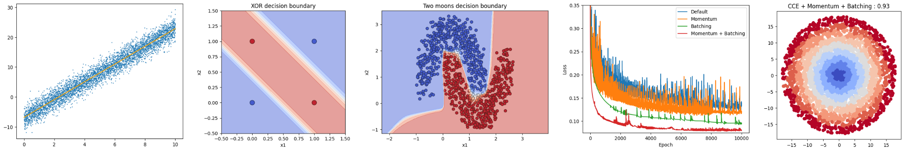

<p align="center">
  
</p>

# Neural networks from scratch

A minimal neural network framework built from scratch using only NumPy, designed for learning and experimentation.

## Summary

### Motivation

This project is the result of my efforts in understanding the mathematical and computational background behind neural networks. Even though I have been a "competent" neural network "practitioner" for years, and I have read through fairly detailed write-ups and tutorials on the topic, I always felt something was missing. That *something*, I now realize, was knowing inside and out how a neural network works, at the level of individual operations. And for this, I think it is required to implement one, including backpropagation, from scratch (within limits; implementing matrix operations from scratch is interesting, but it is not that conceptually relevant).

Working on this project has been incredibly formative, and I only regret that I had not done it earlier. My advice to any new up-and-coming learners in neural networks is: make your own! Obligatory Richard Feynman quote,
> "What I cannot create, I do not understand."

### Goal

I aimed to implement a minimal working neural network with NumPy as the only dependency. Within *minimal working*, I set out to include generalized densely connected networks, with variable number of layers and neurons, as well as a few useful activation and loss functions. I decided that I would consider the project finished if I could use my code to train a competent MNIST digit classifier.

### Features

The code provides modular implementations of layers, activation and loss functions, an optimizer, and a simple sequential model. The implementation should make it easy to test and add new functionality.

The repository also includes notebooks that illustrate the application of the code step-by-step. These range from introductory, such as general gradient computation, to fairly advanced, such as representation learning. Additionally, this page provides documentation covering both the API and the mathematical background, including derivations of relevant functions.

List of features:

* Sequential neural network model interface
* Layer: Dense 
* Activation functions:
	* Sigmoid
	* Softmax
* Loss functions:
	* MSE (Mean Squared Error)
	* BCE (Binary Cross Entropy)
	* CCE (Categorical Cross Entropy)
* Optimizer: SGD with momentum
* Batch generator
* Examples (notebooks)
* Documentation
* Testing coverage

## Installation


### Minimal

If you only want to install the module

```bash
# install nnfs module with pip
pip install git+https://github.com/Mikel-MG/neural-networks-from-scratch
```

### Full

If you want to run the examples, or modify the code, I recommend cloning the project and doing an editable installation. The first time that you source the setup script, it will create a virtual environment and install the additional development dependencies.

```bash
# clone repository to local folder
git clone https://github.com/Mikel-MG/neural-networks-from-scratch

# set up environment
source ./scripts/setup.sh

# run integration tests
./scripts/run_tests.sh
```

## Documentation

The accompanying documentation site can be accessed [here](https://mikel-mg.github.io/neural-networks-from-scratch/).

## Example

```python
# setup
from nnfs.layers import Dense
from nnfs.model import Sequential
from nnfs.losses import MSE
from nnfs.optimizers import SGD

from nnfs.datasets.data_generators import generate_linear_data

# generate data
X_data, y_true = generate_linear_data(3, -7, 5000)

# define the model
list_layers = [Dense(1, 1)]
loss = MSE()
optimizer = SGD()
model = Sequential(list_layers, loss, optimizer)
model.summary()

# fit model to data
history = model.fit(X_data, y_true, 1000, debug_flag=True)
```

For the full list of commented examples, check out the `Examples` section in the documentation site.